<p align="center">
  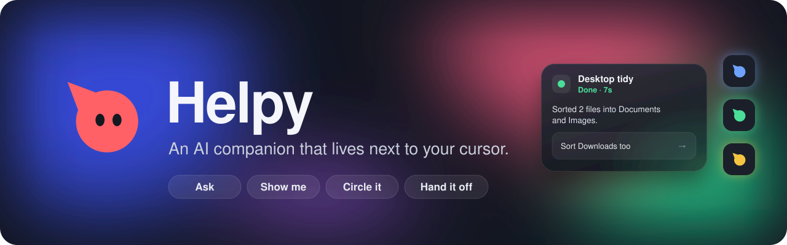
</p>

<p align="center">
  
  
  
  
  
  
</p>

<p align="center">
  <b>Ask out loud. Helpy looks at your screen and points at the answer.</b><br>
  It draws highlights and arrows on top of your real apps, walks you through things step by step,<br>
  and runs AI agents in the background that you start just by talking.
</p>

<p align="center">
  <a href="#see-it">See it</a> ·
  <a href="#what-it-does">What it does</a> ·
  <a href="#run-it">Run it</a> ·
  <a href="#tests">Tests</a> ·
  <a href="#project-layout">Project layout</a> ·
  <a href="docs/PLAN.md">Plan</a>
</p>

<p align="center">
  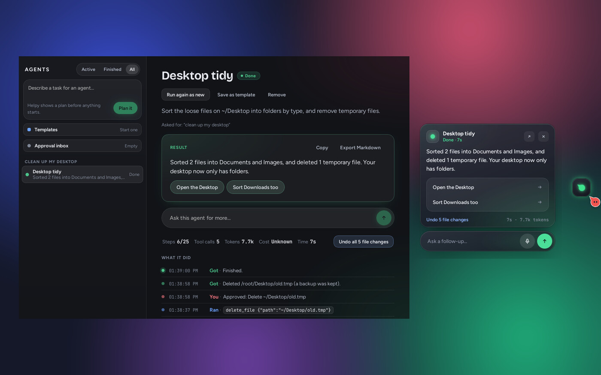
</p>

Built with Tauri v2 (Rust) and React + TypeScript. Windows and macOS are first class, Linux X11 is supported, Linux Wayland is best effort. It works with Anthropic, OpenAI, Gemini, or a model on your own computer (Ollama, LM Studio, llama.cpp), with your own keys.

## See it

<table>
  <tr>
    <td width="50%" align="center">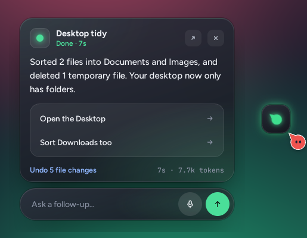<br><sub><b>The dock.</b> One glowing chip per agent at the screen edge; hover it for its card.</sub></td>
    <td width="50%" align="center">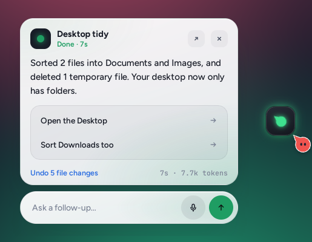<br><sub>Light or dark, following your system. Follow up by text or voice.</sub></td>
  </tr>
  <tr>
    <td align="center">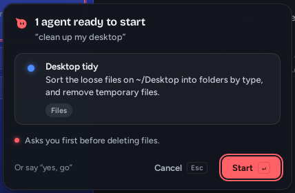<br><sub><b>Plans first.</b> Every task shows its agents, tools and what they'll ask before anything starts.</sub></td>
    <td align="center">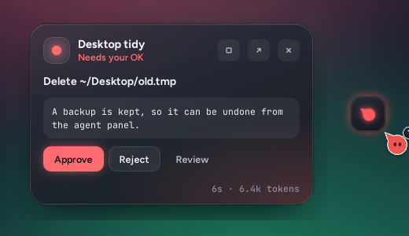<br><sub><b>You stay in charge.</b> Deletes, sends and commands wait for your OK.</sub></td>
  </tr>
  <tr>
    <td align="center">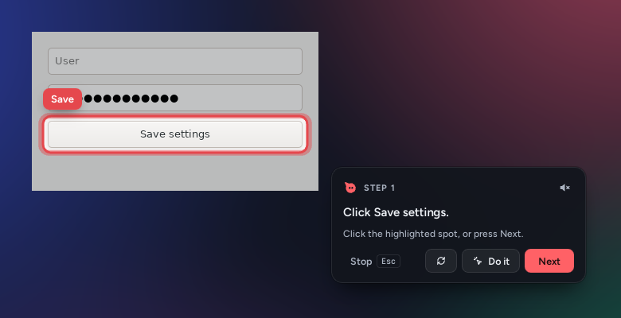<br><sub><b>Walkthroughs.</b> Highlights snap onto the real button. "Do it" clicks it for you after you confirm.</sub></td>
    <td align="center">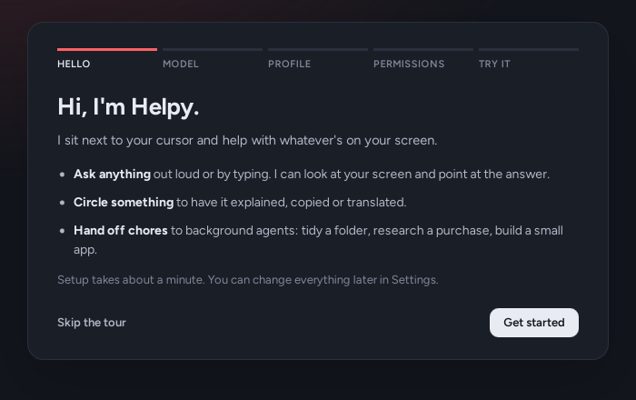<br><sub><b>Welcome tour.</b> Pick a model, a behavior profile and permissions in about a minute.</sub></td>
  </tr>
</table>

<table>
  <tr>
    <td width="50%" align="center">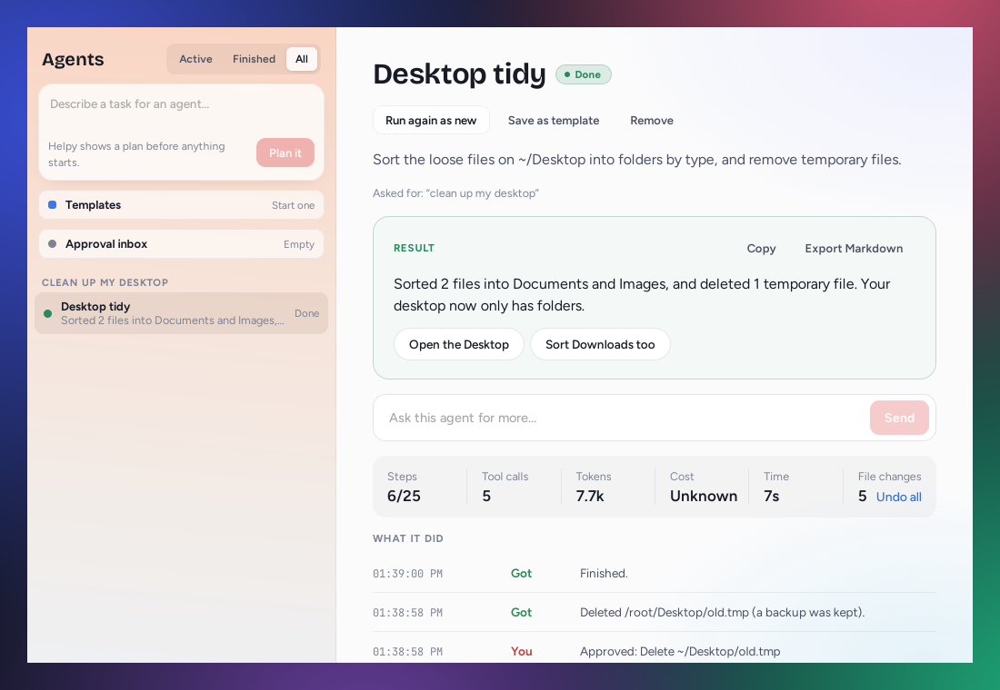<br><sub><b>The agent panel</b>, light: every agent, its result, timeline, spending, and one-click undo.</sub></td>
    <td width="50%" align="center">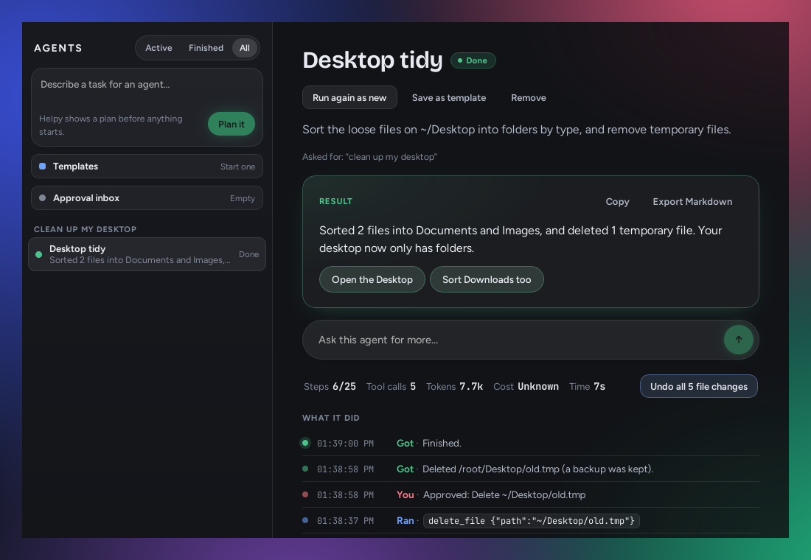<br><sub>Dark. On macOS and Windows 11 it's translucent (vibrancy and Mica).</sub></td>
  </tr>
  <tr>
    <td align="center">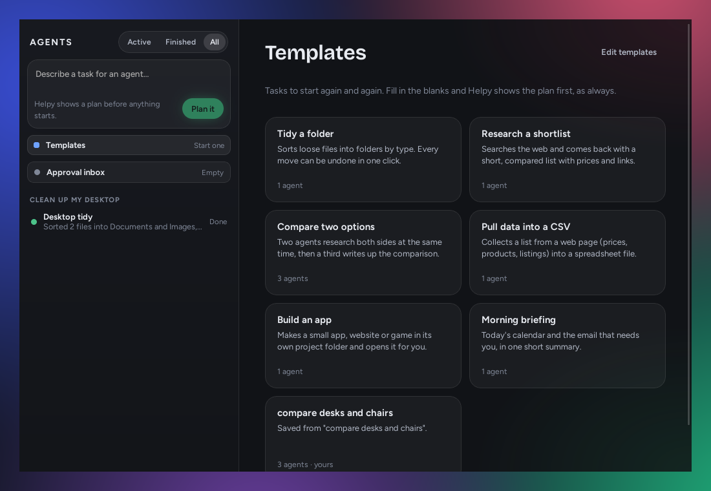<br><sub><b>Templates.</b> Tidy a folder, research a shortlist, pull a page into a CSV, build an app.</sub></td>
    <td align="center">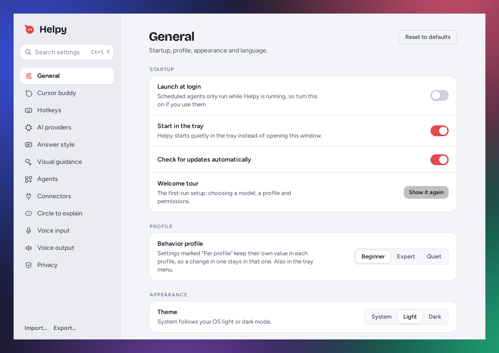<br><sub><b>Settings.</b> Searchable, instant, with import and export.</sub></td>
  </tr>
</table>

<sub>Screenshots are from the Linux build with a test model. On macOS and Windows 11 the panel and cards also blur what's behind them.</sub>

## What it does

<details>
<summary><b>Around your cursor</b></summary>

- **Cursor buddy.** A small character follows the pointer on every monitor, with per-monitor DPI handled in Rust. Three built-in styles (Pip, Spark, Dot) or your own SVG/PNG. Size, opacity, offset and follow smoothness are adjustable. It auto-hides in fullscreen apps and, optionally, when the mouse rests.
- **Overlays.** One transparent, always-on-top, click-through window per monitor. They're hidden from the taskbar and excluded from screen capture (`WDA_EXCLUDEFROMCAPTURE` on Windows, `NSWindowSharingNone` on macOS). They are rebuilt when monitors are plugged in or removed.
- **Tray.** Toggle the buddy, toggle voice guidance, pause screen capture, circle to explain, open the agent panel, open the approval inbox, switch behavior profile, open settings, quit. The icon changes when capture is paused.
- **Global hotkeys.** All nine actions can be rebound. Duplicates are rejected, and combinations the OS already uses get a warning. The hotkeys for actions that exist now (voice ask, text ask, circle to explain, open agent panel, open approval inbox, pause all agents, open settings, pause capture, clear annotations) are registered with the OS. The rest are saved and marked "Not active yet".

</details>

<details>
<summary><b>Ask, and be shown</b></summary>

- **Text questions (Alt+Shift+T).** A panel opens next to the cursor. Answers stream in, and follow-ups keep the context until you close it (Esc). Answer style decides whether Helpy sends a screenshot with every question, asks you first, or lets the model decide. Screenshots are of the monitor under the cursor, downscaled to 1568 px, and never include Helpy's own windows.
- **Voice (Alt+Shift+Space).** Hold to talk, or press to start and stop. A small glowing waveform appears by the cursor, shows what you're saying, then a short caption of the answer; click it for the full conversation. Speech recognition runs on your computer with Whisper, or through OpenAI or Deepgram. Answers are read aloud sentence by sentence as they arrive, in a system voice, a Piper voice or an OpenAI voice. Esc stops listening, answering and speaking. Optional wake word ("hey helpy"), noise suppression, auto-stop on silence, and a microphone picker with a live level meter.
- **Visual guidance.** Ask "where is…" or "how do I…" about the app in front of you and Helpy shows you instead of only telling you: it highlights the control (optionally dimming the rest of the screen), points at it with a labelled pointer, or draws an arrow, all on the click-through overlay. Walkthroughs go one step at a time. A small step card ("Step 2 of 4", Next, Repeat, Stop) is the only clickable part. Click the highlighted spot (or press Next) and Helpy takes a fresh screenshot to check the result before showing the next step. Esc or Stop ends it. Steps are read aloud when voice guidance is on, which you can switch from the card. Models with tool calling use a `show_step` tool; others reply with a JSON step, which is validated the same way. Coordinates outside the screenshot are sent back to the model to correct. A walkthrough stops after 12 steps by default.
- **Snapping and "Do it for me".** Highlights and pointers move onto the real button or field under them, using the OS accessibility layer (UI Automation, the macOS AX API, AT-SPI). With "Do it for me" on (off by default), the step card gets a Do it button: Helpy marks exactly where it will click, and clicks only after you confirm that one click.
- **Circle to explain (Alt+Shift+C).** The screen freezes under a light dim, and you drag a box or draw freehand around anything. Helpy explains what's in it. For diagrams, pictures and busy interfaces it also labels the parts, textbook style, with labels placed around the selection that never overlap each other or the card; click a label for more about that part. The other actions are one click away: copy the text in it (read by the vision model, straight to the clipboard), translate it, summarize it, or ask your own follow-up questions about it. Only while this is open does the overlay take the mouse, and only on that monitor; Esc, the close button or a click outside gives every click back to your apps. It uses the model routed to Circle to explain, or the questions model.

</details>

<details>
<summary><b>Background agents</b></summary>

- **Agents.** Ask for background work in your own words ("clean up my desktop", "remind me about the dentist tomorrow at 3", "research standing desks under £400"), by voice or text, from the agent panel, or from a circled part of the screen ("To agent"). Helpy plans one to five agents and shows a plan card first: each agent's goal and tools, what it will ask you before doing, and any folder it needs. Start with Enter, a click, or by saying "yes, go". Several agents run all at once or one after another, under a running limit.
  - Agents can search the web (DuckDuckGo by default, rate limited; Brave with an API key; or your own SearXNG), read public web pages (never local or private addresses), work with files only in folders you approved, run shell commands under your shell policy, and add reminders and calendar events: Reminders and Calendar on macOS, Outlook on Windows when it's installed, Helpy notifications otherwise. Tools a computer can't support are never offered.
  - Every file change is backed up and a whole run can be undone in one click. File changes go ahead by default because they're undoable; deletes, reminders and commands ask first. Approvals, questions and "retry, skip or cancel?" come to you on the agent's card; a rejected action never runs.
  - Limits are enforced in Rust and can't be talked around: steps and tool calls per agent, a time limit, per-agent, per-batch and daily token and cost budgets checked before every call (failed attempts count), and stuck detection (the same action or reply repeated, or several steps with nothing new). Long-running agents summarize older work to stay within their model. Agents are saved after every step, so an agent running when Helpy quits comes back paused with its limits where they were.
  - **The dock:** a glowing chip per agent at the screen edge. Blue is working, green done, yellow a question, red needs permission or went wrong. Hover a chip for its card: what it's doing in plain words, the last command, progress, and the buttons it needs (approve, answer, retry, raise a budget once, undo). A finished agent's card shows its result and suggested next steps, with a follow-up bar (text or voice) floating under it. The dock follows the light or dark theme. New chips drop in like water and ripple, chips waiting for you nudge now and then, and all motion stops when the OS asks for reduced motion. Finished open-ended agents (an app, a site) stay ready for changes; follow up by text or voice and the same agent carries on. When a spoken request becomes an agent, the voice waveform glides into the dock and becomes its chip.
  - **The agent panel (Alt+Shift+A):** every agent grouped by request, with its live status, full result, a timeline of what it did, tokens, cost and time, and pause, resume, cancel, retry, run again, rename, remove, export to Markdown and undo.
  - **Teams of agents.** A plan can have agents that wait for others and get their results ("two researchers, then a writer"). An agent can also split its task among up to 5 helpers that work at the same time and report back; helpers show nested under it. While an agent works you can type or say a change ("skip the second shop") and it takes it into its next step.
  - **Templates.** Tasks to start again and again, with blanks to fill in: tidy a folder, research a shortlist, compare two options, pull data into a CSV, build an app, morning briefing, and your own (save any finished request as one). Start them from Templates in the panel, or just ask and Helpy picks one.
  - **Triggers.** Agents that start by themselves: on a schedule ("weekdays at 9:00") or when new files land in a folder ("sort new files in Downloads"). At most 10 runs an hour and never more often than every 10 minutes; a trigger pauses after 3 failures in a row. They run while Helpy is running.
  - **Web browser and CSV.** For pages that need JavaScript, clicks or forms, agents use a headless Chrome, Edge, Chromium or Brave that's already installed (or a Chromium that settings downloads), with Helpy's own profile. They can read tables and save them as CSV files in the projects folder, previewed on the card and opened with one click. Typing into websites asks first.
  - **Builder agents.** "Build me a pomodoro timer" makes an app or site in its own folder under the projects folder and opens it. If Claude Code, Codex or opencode is installed, the agent hands it the coding (headless, with that tool's own sign-in), and you can pick one or your own command in settings; otherwise Helpy writes the code with your AI model. Follow up with changes and the same agent carries on in the same folder. Coding rounds, commands and launches ask first by default.

</details>

<details>
<summary><b>Connectors and MCP</b></summary>

- **Connectors.** Agents can use Gmail, Google Calendar, Google Drive, Notion, Outlook (mail and calendar), Slack and GitHub. Each has a few focused actions: Gmail can search, read, draft and send; Slack can search, list channels, read history and post; and so on. Sign in happens in the browser (OAuth with PKCE and a loopback redirect) through an OAuth app you make once, with a short guide in settings for each provider. Notion, Slack and GitHub also take a pasted token. Tokens live in the keychain and refresh on their own.
  - Each service can be read-only or read and write, and every action has its own rule (Allow, Ask me, Never). Reads are allowed, drafts are allowed, and anything that sends, posts or creates asks first. Rules are checked where tools run, so no path skips them.
  - **MCP servers:** add programs that run on your computer (stdio, e.g. `npx` or `uvx`) or remote servers (Streamable HTTP). Environment variables and headers can be marked secret, and those values go to the keychain. Remote servers that want a sign-in (Jira, Linear, Sentry…) use OAuth discovered from the server as the MCP spec describes, with dynamic client registration when the server offers it. Pick a ready-made entry (Atlassian, Linear, Notion, GitHub, Sentry, Stripe, Context7, AWS, files, Playwright), fill in your own, or paste the `mcpServers` JSON other apps use; export works the same way, with secrets left out. The older SSE transport isn't supported. Tools the server marks read-only are allowed; others ask first.
  - **The approval inbox (Alt+Shift+I):** everything waiting for your OK across all agents, with the full content. Text fields (an email body, a post, an issue) can be edited before approving, and several actions from one place can be approved at once. By voice: "approve", "reject", or "approve all from Gmail". "Connect my Gmail" starts the sign-in.

</details>

<details>
<summary><b>Settings, privacy and limits</b></summary>

- **Welcome tour.** A fresh install opens a short setup in the settings window: choose a model (on this computer or in the cloud), pick a behavior profile, allow what the OS asks for (macOS), and see the hotkeys. It can be run again from General.
- **Settings window.** Search (Ctrl/Cmd+F), instant apply, per-section reset, JSON import/export, inline validation, and light/dark/system theme. Sections: General, Cursor buddy (with a live preview that follows your mouse), Hotkeys, AI providers, Answer style, Visual guidance (with a live preview), Agents, Connectors, Circle to explain, Voice input, Voice output.
- **AI providers.** Anthropic, OpenAI, Google Gemini, Ollama, LM Studio, llama.cpp server and any OpenAI-compatible endpoint, all streaming. Add a provider from a preset, find local models with one click, load a provider's model list, test the connection, and choose which model each feature uses. API keys go in the OS keychain.
- **Behavior profiles.** Beginner, Expert and Quiet each keep their own values for nine settings (answer detail, reading aloud, agent announcements and notifications, label notes, motion). Switch from the tray or General; a change you make sticks to the profile you're in, and those settings are marked "Per profile".
- **Privacy.** A blocklist of apps and title words, pre-filled with common password managers: while one is in front Helpy won't take a screenshot, and when it's behind other windows it's blanked out, title bar included. Password fields the OS reports are blanked in every screenshot. Offline mode keeps model calls, speech recognition and voices on this computer or your local network; agents' web tools still work.
- **The page on screen.** "Pull the prices from this page into a CSV" uses the address of the page open in your browser (read through accessibility, even while Helpy's panel is in front). It's only sent when the request is about the page, and never while capture is paused or when the address matches the blocklist.
- **Usage history.** The last 30 days of tokens and cost per day, per feature and per model, under AI providers. Counted on this computer only.
- **Retry and budget limits, enforced in Rust.** Timeouts, network errors, rate limits (honoring `retry-after`), provider 5xx errors and garbled output are retried with exponential backoff, up to 3 times by default. Bad keys, missing models and refusals are never retried on the same model. Fallback models get one attempt each and count toward the retry limit. A daily token limit (and an optional cost limit) is checked before every call, retries included, and spending is saved to disk so it survives restarts.

</details>

## Run it

Prerequisites: Node 20+, Rust stable, and the [Tauri system dependencies](https://tauri.app/start/prerequisites/). On Debian/Ubuntu:

```sh
sudo apt install libwebkit2gtk-4.1-dev build-essential libxdo-dev libssl-dev \
  libayatana-appindicator3-dev librsvg2-dev libpipewire-0.3-dev libclang-dev \
  libasound2-dev libspeechd-dev cmake libxtst-dev libgbm-dev
```

PipeWire is used for screen capture on Wayland, ALSA for the microphone, speech-dispatcher for system voices, XTest/XRecord for noticing clicks during walkthroughs, and CMake builds whisper.cpp (on macOS and Windows too). API keys are stored through the Secret Service (GNOME Keyring or KWallet), so one of those needs to be running to save keys on Linux; local providers work without it.

Then:

```sh
npm install
npm run tauri dev
```

Helpy starts in the tray. Open settings from the tray menu or with Alt+Shift+S. To have the window open on launch instead, turn off **General → Start in the tray**.

To ask questions, add a provider under **Settings → AI providers**. The quickest free option is [Ollama](https://ollama.com) with a vision model such as `llama3.2-vision`: start it, click **Add provider → Find models on this computer**, and press Alt+Shift+T anywhere.

## Tests

```sh
npm test                          # frontend: key handling, follow smoothing, settings registry
cd src-tauri && cargo test        # backend: settings, hotkeys, monitor math, provider request mapping,
                                  # SSE parsing, screenshot mapping, the retry/budget limits, and audio
                                  # (resampling, silence detection, noise suppression, sentence splitting),
                                  # guidance steps (validation, overlay mapping, click hit-testing), and
                                  # circle to explain (cropping, the PARTS reply, model choice), and agents:
                                  # a scripted fake provider and fake tools prove every limit (steps, tool
                                  # calls, time, budgets, repeats, no progress, retries, approvals, restarts),
                                  # plus file undo, path escapes, private-address fetches and search parsing,
                                  # and connectors: the OAuth flow against a mock server (PKCE checked),
                                  # MCP discovery, each service's parsing, MCP JSON import/export, and a
                                  # real stdio MCP server round trip
```

## Project layout

```
src-tauri/src/
  settings/     typed schema (source of truth), validation, persistence, commands
  ai/           provider adapters (anthropic, openai, gemini), SSE, limits, ledger,
                keychain secrets, and the ask flow
  capture.rs    screenshots of the cursor's monitor, and model-to-screen coordinate mapping
  guide/        guidance steps (schema, validation, mapping), the step card, click detection
  circle/       circle to explain: selection mode, cropping, the PARTS reply, actions
  agents/       the agent runner and its limits, planner, templates, triggers, tools (files
                with undo, web, search adapters, shell, reminders, browser and CSV, builders),
                SQLite store, scheduler with dependencies and helpers, commands
  connectors/   OAuth (PKCE, loopback, MCP discovery), the Connector trait and one file per
                service (google, microsoft, notion, slack, github)
  mcp/          MCP client (stdio and Streamable HTTP), JSON import/export, the catalog
  voice/        microphone, audio processing, Whisper and cloud speech to text, text to speech
                (system, Piper, OpenAI), wake word, and the listening session
  overlay.rs    per-monitor overlay windows
  cursor.rs     cursor polling, per-monitor coordinates, buddy visibility
  fullscreen/   fullscreen-app detection for Windows, macOS and X11
  hotkeys.rs    global hotkey registration and conflict warnings
  tray.rs       tray menu and icon state
src/
  bindings/     TypeScript types generated from the Rust schema (do not edit)
  buddy/        the buddy character and smoothing, shared by overlay and settings
  overlay/      overlay window app
  ask/          the ask panel
  pill/         the compact voice waveform
  guide/        highlights, pointers and arrows, shared by the overlay and the settings preview
  step/         the walkthrough step card
  circle/       selection, the result card, and diagram label placement
  plan/         the agent plan card
  dock/         the agent dock and its hover cards
  agents/       the agent panel and the approval inbox
  settings/     settings window app; registry.ts lists every setting's label and control
design/         source SVGs for the app and tray icons
```

### Adding a setting

1. Add the field and its default in `src-tauri/src/settings/schema.rs`, and any range check in `validate.rs`.
2. Run `npm run bindings` to regenerate the TypeScript types.
3. Add one entry to `FIELDS` in `src/settings/registry.ts`. A test fails if a setting in a shown section has no entry.

## Platform notes

- **macOS:** transparent windows need `macOSPrivateApi`, which rules out the Mac App Store. Direct downloads are fine. Screenshots need the Screen Recording permission, and snapping, password blanking, the page address and "Do it for me" need Accessibility. The welcome tour links to both. Without Accessibility those features quietly do nothing.
- **Native translucency.** On macOS the agent panel, the dock card and the step card use vibrancy, and the panel's traffic lights float over its sidebar. On Windows 11 the panel uses Mica, and the dock card and step card use Acrylic (22H2 or later). With native glass the dock card is one frosted shape with the follow-up field inside; on Linux and older Windows the panel is opaque, and the dock card keeps its CSS glass with the follow-up bar floating underneath.
- **Agent notifications** use the system's notification service (on Linux, a notification daemon has to be running). On macOS, the first reminder or calendar event asks for Automation permission for Reminders or Calendar.
- **Clicks during walkthroughs** are observed with a listen-only mouse hook (`rdev`); the click still reaches your app. On macOS this needs the Accessibility permission, and on Wayland it isn't available. Without it, the step card asks you to press Next instead.
- **Accessibility on Linux** goes through AT-SPI, which Helpy switches on for the session when it first needs it (as a screen reader would). Apps that run natively on Wayland don't report screen positions, so snapping and password blanking only see XWayland and X11 apps. The blocklist needs a window manager that lists windows; the Privacy page says when it can't.
- **Linux:** overlays need a compositing window manager to be transparent; the settings page warns when none is running. On Wayland, Helpy runs through XWayland when it can. The General section lists what won't work in your session.
